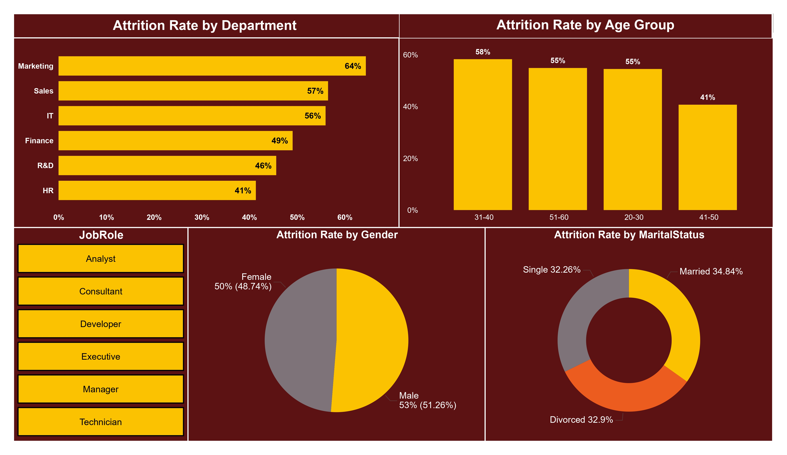
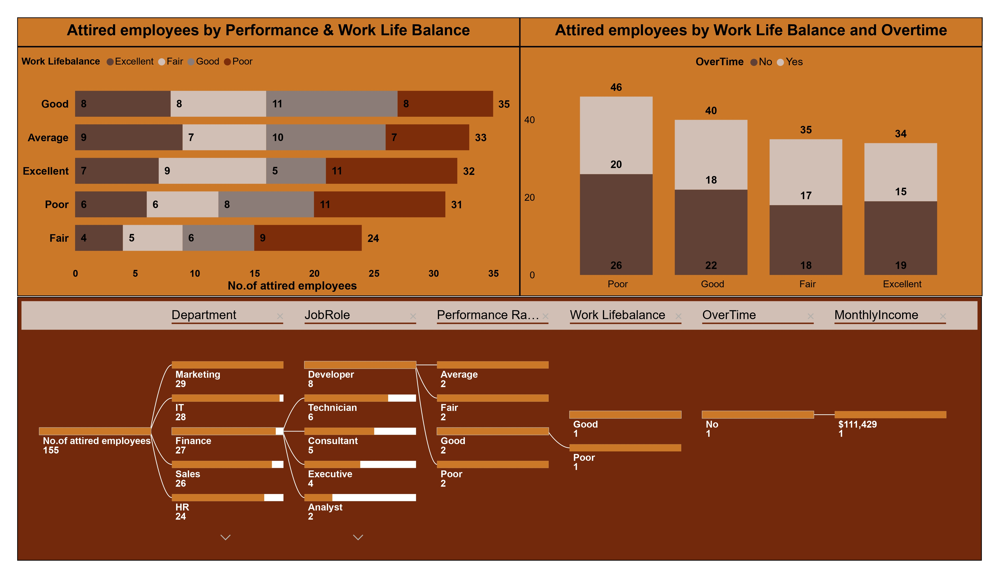

# HR Analytics – Employee Insights Project

## 📊 Project Overview
This HR analytics project analyzes employee data to uncover insights related to:
- Employee attrition
- Compensation trends
- Workforce demographics
- Job roles and departments

The analysis was performed using **Power BI**, with a focus on supporting data-driven HR decision-making.

---

## 🛠 Tools & Technologies
- Power BI
- CSV dataset
- Data visualization & dashboarding

---

## 📈 Key Insights
- Higher attrition observed in specific departments and job roles  
- Attrition is more common among certain age groups  
- Monthly income varies significantly by job role and overtime status  
- Clear relationship between work-life balance and employee retention  

---

## 🖼 Dashboard Preview

### Overall HR Dashboard

### Attrition Analysis

### Compensation Analysis

---

## 📁 Files in This Repository
- `HR employee dataset.csv` → Cleaned and anonymized employee dataset  
- `hr_analytics_dashboard.pbix` → Power BI dashboard file  
- Dashboard screenshots (`.jpg`)  
- `README.md` → Project documentation  

---

## 🔒 Data Privacy
The dataset used in this project has been **anonymized** and contains **no personally identifiable information (PII)**.  
This project is intended for **educational and portfolio purposes only**.

---

## 👤 Author
**Mohamed Khaled**  
HR Professional | HR Analytics Enthusiast  

📌 GitHub: https://github.com/MohamedBakr180
